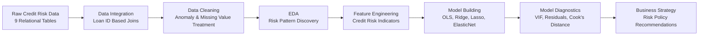
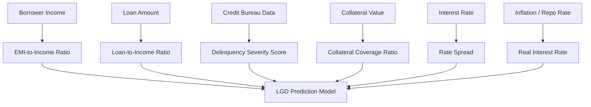

# 🏦 FinSight Bank Credit Risk Analytics & LGD Prediction Engine


---

## 📌 Executive Overview

**FinSight Bank Credit Risk Analytics & LGD Prediction Engine** is an end-to-end **Big Data Analytics and Machine Learning project** developed for a retail lending portfolio of **2,000,000 loan records**.

The project focuses on identifying the major drivers of **Non-Performing Assets (NPAs)** and predicting **Loss Given Default (LGD)** for defaulted loan accounts.

This solution follows an industry-style analytical workflow covering:

- Large-scale data integration  
- Data quality management  
- Exploratory Data Analysis  
- Credit risk feature engineering  
- Statistical regression modeling  
- Regularized machine learning models  
- Model diagnostics and validation  
- Strategic business recommendations  

---

## 🎯 Business Problem

Banks face major financial losses when borrowers default and the recovery amount is low. Therefore, it is important to understand:

> Which borrower and loan characteristics increase default risk?

> Which features increase Loss Given Default?

> How can the bank reduce future credit losses through better policy decisions?

This project solves these questions using a structured analytics and modeling pipeline.

---

## 🧠 Project Objective

The objective of this project is to build a reliable **credit risk analytics engine** that can:

| Objective | Business Value |
|---|---|
| Identify NPA drivers | Helps detect high-risk borrower segments |
| Predict LGD percentage | Supports better capital and loss planning |
| Engineer credit risk features | Improves model interpretability |
| Validate model assumptions | Ensures statistical reliability |
| Recommend risk policies | Helps reduce future lending losses |

---

## 📂 Repository Deliverables

| Deliverable | Description |
|---|---|
| `FinSight_Credit_Risk_Pipeline.ipynb` | Fully executed Jupyter Notebook containing data cleaning, EDA, feature engineering, modeling, diagnostics, and visual analysis |
| `FinSight_Executive_Summary.pdf` | Board-ready PDF report containing executive findings, business insights, and policy recommendations |
| `README.md` | Project documentation explaining the complete workflow, methodology, and outcomes |

---

## 🏗️ End-to-End Project Architecture



---

## 📊 Dataset Scale

| Metric | Value |
|---|---|
| Total Records | 2,000,000 |
| Data Tables | 9 |
| Target Variable | `lgd_pct` |
| Default Filter | `loan_status == 1` |
| Modeling Type | Regression |
| Business Domain | Retail Lending / Credit Risk |

---

## 🧹 1. Data Cleaning & Structured Imputation

The raw data was integrated from multiple relational tables using `loan_id` as the common key.

### Key Cleaning Activities

| Activity | Method |
|---|---|
| Table integration | Progressive left joins |
| Data validation | Row-count assertions |
| Anomaly detection | Binary `dirty_flag` |
| Negative and impossible values | Median/mode correction |
| Missing value treatment | Structured imputation |
| High-missing columns | MNAR classification |
| Outlier treatment | 1st and 99th percentile winsorization |

### Data Quality Result

```text
Initial Data Size  : 2,000,000 records
Final Data Size    : 2,000,000 records
Data Loss          : 0 records
Missing Values     : Treated
Outliers           : Winsorized
Dirty Records      : Flagged and corrected
```

---

## 📈 2. Exploratory Data Analysis

The EDA stage includes portfolio-level risk analysis using **12 mandatory visualizations** with analytical captions.

### Key EDA Insights

#### 1. Credit Score Distribution

The bank’s underwriting historically favored borrowers with CIBIL scores mainly between **650 and 750**.

However, there was visible overlap between performing and defaulted borrowers, proving that:

> Credit score alone is not sufficient for predicting loan loss severity.

---

#### 2. Risk-Based Pricing

The bank’s internal grade system from **A to G** showed proper pricing behavior.

| Grade | Risk Level | Pricing Pattern |
|---|---|---|
| A-B | Low Risk | Lower interest rate |
| C-E | Medium Risk | Moderate interest rate |
| F-G | High Risk | Higher interest rate |

This confirms that weaker credit grades are charged higher interest margins.

---

#### 3. Portfolio Vulnerability Areas

The analysis identified high-risk concentration in:

- Small business loans  
- Speculative borrowing purposes  
- High EMI burden customers  
- Borrowers with recent delinquency history  
- High-risk geographic regions  

---

#### 4. Macroeconomic Shock Analysis

The project also studied the impact of macroeconomic events such as the **COVID-19 shock of 2020** and repo rate movements.

```text
Economic Shock → Borrower Stress → Repayment Delay → Default Wave → Higher LGD
```

---

## 🧩 3. Feature Engineering

A total of **12 accountable credit risk features** were engineered and validated against `lgd_pct`.

### Feature Categories

| Category | Engineered Features |
|---|---|
| Repayment Pressure | `emi_to_income_ratio`, `loan_to_income_ratio`, `rate_spread_pct`, `real_interest_rate` |
| Bureau Behaviour | `credit_util_composite`, `enq_velocity_score`, `delinq_severity_score` |
| Asset Backing | `income_stability_ratio`, `credit_depth_score`, `collateral_coverage_ratio` |
| Transformation Features | `log_annual_income`, `log_loan_amount` |

---

## 🔍 Feature Engineering Flow



---

## 🤖 4. Regression Modeling & Machine Learning

Modeling was performed only on defaulted accounts:

```python
loan_status == 1
```

This ensures that LGD prediction is applied only where loss severity is meaningful.

---

## 🧪 Models Implemented

| Model | Purpose |
|---|---|
| OLS Regression | Baseline statistical model |
| Ridge Regression | Reduces multicollinearity impact |
| Lasso Regression | Performs automatic feature selection |
| ElasticNet Regression | Combines Ridge and Lasso benefits |

---

## 🛡️ Leakage Prevention

Post-default variables such as recovery fees were excluded from the model to prevent target leakage.

```text
Only pre-default borrower, loan, bureau, and macroeconomic variables were used.
```

---

## 📉 Model Diagnostics

A complete diagnostic suite was used to validate model reliability.

| Diagnostic Test | Purpose |
|---|---|
| VIF Analysis | Detects multicollinearity |
| Residual Plot | Checks linearity |
| Q-Q Plot | Checks error normality |
| Scale-Location Plot | Checks homoscedasticity |
| Cook's Distance | Detects influential observations |

---

## ⚙️ Model Validation Strategy

The machine learning models were optimized using:

```text
GridSearchCV + 5-Fold Cross Validation
```

The **Lasso Regression model** helped remove uninformative variables by shrinking weak coefficients to zero.

---

## 📊 Suggested Visualizations Included

The notebook includes industry-relevant visual outputs such as:

- CIBIL score distribution by loan status  
- Interest rate trend by internal grade  
- Default rate by loan purpose  
- Geographic default concentration  
- LGD distribution plot  
- Correlation heatmap  
- EMI-to-income ratio vs LGD  
- Collateral coverage vs LGD  
- Macroeconomic timeline analysis  
- Residual diagnostic plots  
- Cook’s Distance plot  
- Model performance comparison chart  

---

## 🏛️ 5. Strategic Risk Recommendations

### ✅ 1. Enforce EMI-to-Income Ceiling

Loan applications should be automatically reviewed or rejected if:

```text
EMI-to-Income Ratio > 45%
```

This reduces the probability of borrower over-leveraging.

---

### ✅ 2. Apply Higher Risk Premium for Lower Grades

Borrowers in weaker grades should carry additional risk pricing.

```text
Grades F and G → Additional 250 basis points
```

This helps the bank compensate for higher expected loss.

---

### ✅ 3. Restrict Speculative Lending Exposure

For small business and speculative loan categories:

```text
Reduce maximum LTV by 15%
Require secondary co-signer
```

---

### ✅ 4. Use Dynamic Bureau Monitoring

The engineered `delinq_severity_score` should be integrated into the credit decision system.

This allows early detection of borrowers showing recent repayment stress.

---

### ✅ 5. Strengthen Collateral Requirements

For high-value retail loans above ₹25 Lakhs:

```text
Minimum Collateral Coverage Ratio: 120%
```

This improves recovery confidence and reduces final write-off risk.

---

## 🧾 Key Business Takeaways

| Business Area | Key Finding |
|---|---|
| Credit Score | Helpful but not sufficient alone |
| EMI Burden | Strong indicator of repayment stress |
| Collateral | Higher collateral reduces LGD |
| Delinquency | Recent missed payments are highly important |
| Loan Purpose | Speculative loans show higher risk |
| Macroeconomics | Economic shocks increase default waves |
| Regularization | Improves model stability and feature selection |

---

## 🛠️ Technology Stack

| Category | Tools Used |
|---|---|
| Programming Language | Python |
| Development Environment | Jupyter Notebook |
| Data Processing | Pandas, NumPy |
| Visualization | Matplotlib, Seaborn |
| Statistical Modeling | Statsmodels |
| Machine Learning | Scikit-learn |
| Validation | GridSearchCV, Cross Validation |
| Reporting | PDF Executive Summary |

---

## 📁 Recommended Folder Structure

```text
FinSight-Credit-Risk-Analytics/
│
├── README.md
├── FinSight_Credit_Risk_Pipeline.ipynb
├── FinSight_Executive_Summary.pdf
│
├── data/
│   ├── raw/
│   └── processed/
│
├── outputs/
│   ├── charts/
│   ├── diagnostics/
│   └── model_results/
│
└── reports/
    └── executive_summary/
```

---

## 🚀 How to Run the Project

### 1. Clone the Repository

```bash
git clone https://github.com/your-username/FinSight-Credit-Risk-Analytics.git
cd FinSight-Credit-Risk-Analytics
```

### 2. Install Required Libraries

```bash
pip install pandas numpy matplotlib seaborn scikit-learn statsmodels jupyter
```

### 3. Launch Jupyter Notebook

```bash
jupyter notebook
```

### 4. Run the Notebook

Open and execute:

```text
FinSight_Credit_Risk_Pipeline.ipynb
```

---

## 👨‍💻 Project Submitted By

| Detail | Information |
|---|---|
| Name | Vrundavan Dayma |
| Institute | CDAC |
| Course | Big Data Analytics |
| Project Domain | Credit Risk Analytics |
| Project Title | FinSight Bank Credit Risk Analytics & LGD Prediction Engine |

---

## 🏁 Final Outcome

This project delivers an industry-oriented credit risk analytics solution that converts raw banking data into actionable risk intelligence.

The final system helps FinSight Bank:

- Detect high-risk borrower profiles  
- Understand NPA drivers  
- Predict Loss Given Default  
- Improve credit approval policies  
- Reduce future write-off exposure  
- Support data-driven lending decisions  

---

## ⭐ Project Summary

> FinSight Bank Credit Risk Analytics & LGD Prediction Engine combines Big Data Analytics, statistical modeling, machine learning, and business strategy to support smarter and safer retail lending decisions.

---
